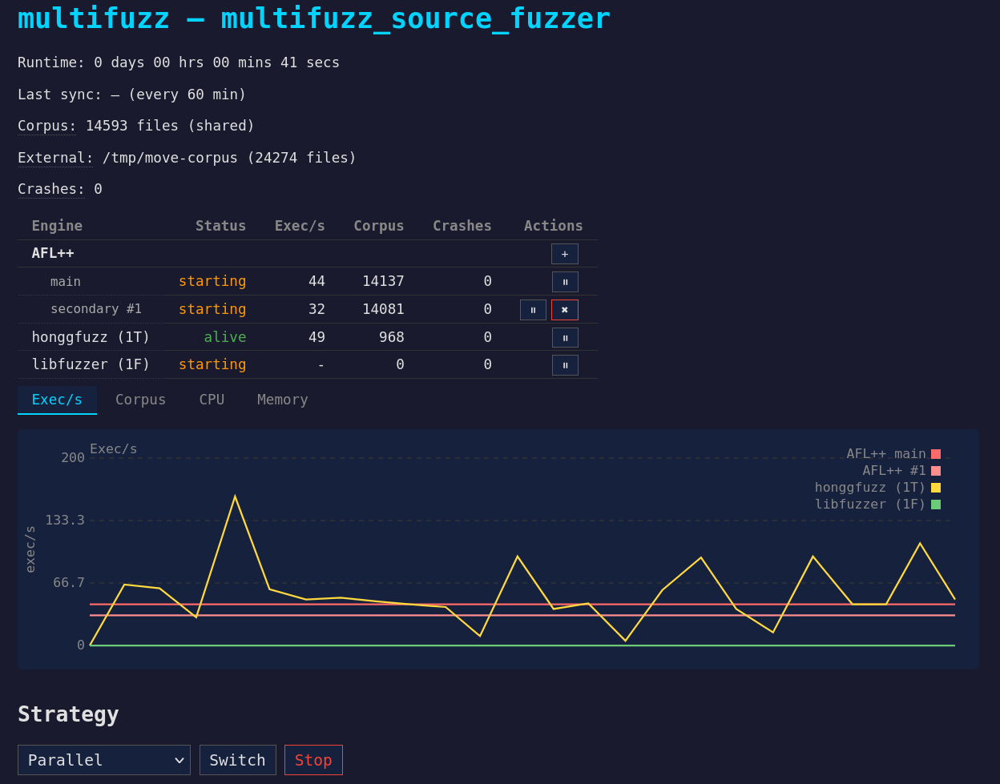

# multifuzz

Multi-engine fuzzing orchestrator for Rust. Runs AFL++, honggfuzz, and libfuzzer in parallel with automatic corpus synchronization and crash collection.



## Usage

Write a fuzz harness using the `fuzz!` macro:

```rust
use multifuzz::fuzz;

fn main() {
    fuzz!(|data: &[u8]| {
        // test your code here
    });
}
```

Structured input via `Arbitrary` is also supported:

```rust
fuzz!(|data: MyStruct| {
    // data is deserialized automatically
});
```

## Prerequisites

Install the fuzzing toolchains:

```sh
cargo install cargo-afl
cargo install honggfuzz
```

## Installation

```sh
cargo install --path path/to/multifuzz
```

## Configuration

Campaigns are configured via a TOML file (`multifuzz.toml` by default, or `--config <path>`). See `multifuzz.toml.example` for a full reference.

```toml
[fuzz]
target = "my_target"
jobs = 4
corpus = "./corpus"
output = "./output"
timeout = 10
strategy = "parallel"       # "parallel", "afl-only", "hongg-only", "libfuzzer-only"
sync_interval = 60
dictionaries = ["./dict.dict"]

[fuzz.web]
enabled = true

# Per-worker AFL++ configuration. No hidden defaults — everything explicit.
# [fuzz.afl.all.env] sets base env vars for every AFL worker.
# [fuzz.afl.workerN]  overrides for specific worker N (0=main, 1+=secondary).
# Worker env = all.env + workerN.env merged (worker wins on conflict).
[fuzz.afl.all.env]
AFL_AUTORESUME = "1"
AFL_FAST_CAL = "1"
AFL_FORCE_UI = "1"
AFL_IGNORE_UNKNOWN_ENVS = "1"
AFL_CMPLOG_ONLY_NEW = "1"
AFL_DISABLE_TRIM = "1"
AFL_NO_WARN_INSTABILITY = "1"
AFL_FUZZER_STATS_UPDATE_INTERVAL = "10"
AFL_IGNORE_SEED_PROBLEMS = "1"

[fuzz.afl.worker0.env]
AFL_FINAL_SYNC = "1"

[fuzz.afl.worker2.env]
AFL_CUSTOM_MUTATOR_LIBRARY = "/path/to/mutator.so"
```

## CLI

```sh
# Build all fuzzer binaries (AFL++, honggfuzz, libfuzzer)
multifuzz build

# Run campaign (reads multifuzz.toml from cwd, or pass --config <path>)
multifuzz fuzz

# Replay a crash or directory of inputs
multifuzz run my_target -i output/my_target/crashes/ -r

# Add external inputs to a running fuzzing session
multifuzz add-corpus my_target -i interesting_inputs/ -r
```

## Web dashboard

An optional lightweight web UI (`[fuzz.web] enabled = true`) provides real-time monitoring, pause/resume controls, and worker scaling for running campaigns.

## How it works

Jobs are distributed across engines automatically. Corpus files are synchronized between engines periodically using hash-based deduplication. Crashes from all engines are collected into a unified `crashes/` directory.

## License

Apache-2.0
